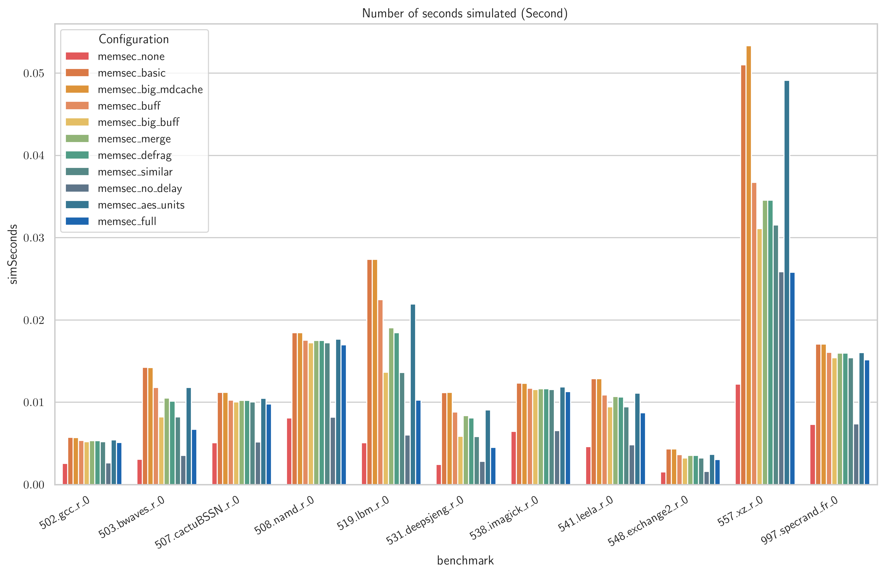

# AIM gem5 Extensions

Below is the original README for gem5.
This repository is a fork of gem5, containing all necessary extensions to implement an implementation of a trusted execution environment (TEE) performance evaluation framework.
The TEE is based on AES counter-mode encryption as well as Intel SGX-style counter trees for integrity and emulates full memory encryption (abbreviated as AIM), as everything outside the processor boundary is considered untrusted.
The Intel SGX-style counter trees are a form of integrity tree and protects the system against spoofing, slicing and replay attacks.

## Important Additions

- [`src/memsec/`](https://github.com/strlst/gem5/tree/stable/src/memsec): The main implementation source files of various gem5 components can be found here.
For a quick overview of configurable parameters, view `AIMCtrl.py`.
The root component of AIM is `aim_ctrl.cc`/`aim_ctrl.hh`.
- [`benchmark/`](https://github.com/strlst/gem5/tree/stable/benchmark): The set of scripts used to automatically compile SPEC CPU 2017, generate a benchmarking script for all configurations up for test, run benchmark for all configurations across all selected benchmarks and automatically generate evaluation plots using any of the >1000 metrics that are generated by gem5/DRAMsim3 per benchmark, can be found here.
- [`configs/aim/simple/`](https://github.com/strlst/gem5/tree/stable/configs/aim/simple): The gem5 configuration (e.g. CPU, caches, memory controller and AIM components) used for testing and benchmarks, with many different CLI parameters, can be found here.
- [`tests/test-progs/matmul/src/matmul.c`](https://github.com/strlst/gem5/blob/stable/tests/test-progs/matmul/src/matmul.c): A simple test program useful for debugging and small-scale design space exploration can be found here.

## Benchmarking

The scripts referenced above are used to run benchmarks.
A selected example of an extracted metric generated by gem5 and evaluated across all configurations for all benchmarks can be found below.
The benchmark results are ignored by git, because the resulting files exceed 1GiB of storage.

By default, there are many more interesting metrics plotted, such as `average_bandwidth`, `average_read_latency`, `num_writes_done`, `num_reads_done`, `cpu.ipc`, `l2cache.overallAvgMissLatency::total`, `l2cache.overallMissRate::total`, `metadata_cache.overallMissRate`.

# The gem5 Simulator

This is the repository for the gem5 simulator. It contains the full source code
for the simulator and all tests and regressions.

The gem5 simulator is a modular platform for computer-system architecture
research, encompassing system-level architecture as well as processor
microarchitecture. It is primarily used to evaluate new hardware designs,
system software changes, and compile-time and run-time system optimizations.

The main website can be found at <http://www.gem5.org>.

## Testing status

**Note**: These regard tests run on the develop branch of gem5:
<https://github.com/gem5/gem5/tree/develop>.

## Getting started

A good starting point is <http://www.gem5.org/about>, and for
more information about building the simulator and getting started
please see <http://www.gem5.org/documentation> and
<http://www.gem5.org/documentation/learning_gem5/introduction>.

## Building gem5

To build gem5, you will need the following software: g++ or clang,
Python (gem5 links in the Python interpreter), SCons, zlib, m4, and lastly
protobuf if you want trace capture and playback support. Please see
<http://www.gem5.org/documentation/general_docs/building> for more details
concerning the minimum versions of these tools.

Once you have all dependencies resolved, execute
`scons build/ALL/gem5.opt` to build an optimized version of the gem5 binary
(`gem5.opt`) containing all gem5 ISAs. If you only wish to compile gem5 to
include a single ISA, you can replace `ALL` with the name of the ISA. Valid
options include `ARM`, `NULL`, `MIPS`, `POWER`, `RISCV`, `SPARC`, and `X86`
The complete list of options can be found in the build_opts directory.

See https://www.gem5.org/documentation/general_docs/building for more
information on building gem5.

## The Source Tree

The main source tree includes these subdirectories:

* build_opts: pre-made default configurations for gem5
* build_tools: tools used internally by gem5's build process.
* configs: example simulation configuration scripts
* ext: less-common external packages needed to build gem5
* include: include files for use in other programs
* site_scons: modular components of the build system
* src: source code of the gem5 simulator. The C++ source, Python wrappers, and Python standard library are found in this directory.
* system: source for some optional system software for simulated systems
* tests: regression tests
* util: useful utility programs and files

## gem5 Resources

To run full-system simulations, you may need compiled system firmware, kernel
binaries and one or more disk images, depending on gem5's configuration and
what type of workload you're trying to run. Many of these resources can be
obtained from <https://resources.gem5.org>.

More information on gem5 Resources can be found at
<https://www.gem5.org/documentation/general_docs/gem5_resources/>.

## Getting Help, Reporting bugs, and Requesting Features

We provide a variety of channels for users and developers to get help, report
bugs, requests features, or engage in community discussions. Below
are a few of the most common we recommend using.

* **GitHub Discussions**: A GitHub Discussions page. This can be used to start
discussions or ask questions. Available at
<https://github.com/orgs/gem5/discussions>.
* **GitHub Issues**: A GitHub Issues page for reporting bugs or requesting
features. Available at <https://github.com/gem5/gem5/issues>.
* **Jira Issue Tracker**: A Jira Issue Tracker for reporting bugs or requesting
features. Available at <https://gem5.atlassian.net/>.
* **Slack**: A Slack server with a variety of channels for the gem5 community
to engage in a variety of discussions. Please visit
<https://www.gem5.org/join-slack> to join.
* **gem5-users@gem5.org**: A mailing list for users of gem5 to ask questions
or start discussions. To join the mailing list please visit
<https://www.gem5.org/mailing_lists>.
* **gem5-dev@gem5.org**: A mailing list for developers of gem5 to ask questions
or start discussions. To join the mailing list please visit
<https://www.gem5.org/mailing_lists>.

## Contributing to gem5

We hope you enjoy using gem5. When appropriate we advise sharing your
contributions to the project. <https://www.gem5.org/contributing> can help you
get started. Additional information can be found in the CONTRIBUTING.md file.
